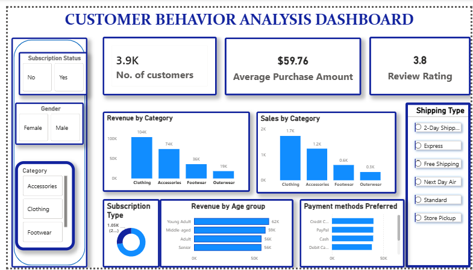

# Customer Behavior Analysis Dashboard 

# Overview
This project analyzes customer shopping behavior using Power BI.  
The dashboard provides insights into customer purchases, revenue by category, payment preferences, and subscription trends.

# Key Features
- Total Customers KPI
- Average Purchase Amount
- Review Rating
- Revenue and Sales by Category
- Payment Methods Preferred
- Subscription Status Analysis
- Interactive filters for Gender, Category, and Shipping Type

# Tools Used
Power BI, MySQL, Data Visualization

# Files
- Customer_Behavior_Analysis_Dashboard.pbix – Power BI dashboard
- customer_shopping_behavior.csv – Dataset

# Author
Pragati Khatri
